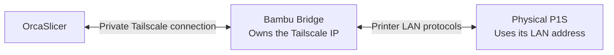

# Bambu Bridge

**Print from Orca through your bridge.** One P1S endpoint and one access code
let you choose a **four-color AMS print or an external-spool print** for each
job, with live printer status and camera access. No connection changes between
jobs. Native P1S support is available in the
[v0.3.2 preview](https://github.com/thereprocase/bambu-bridge/releases/tag/v0.3.2).

[Project site and explainer](https://thereprocase.github.io/bambu-bridge/#orca)
· [Native setup](docs/NATIVE-P1S.md) · [Validation](VALIDATION.md)

A small self-hosted server that connects to a **Bambu Lab P1S** over your
local network and re-exposes it as a clean **HTTP + WebSocket API** — plus a
**3D print-progress viewer** you can open in any browser.

It speaks the printer's LAN protocol for you (MQTT over TLS, FTPS, camera) and
hands back simple, friendly JSON. A companion phone app and a Home Assistant
integration both talk to the bridge — never to the printer directly — so the
clients share the bridge's printer connections.

The bridge communicates directly with your printer over the LAN. Enable
LAN-Only Mode and, on firmware that provides it, Developer Mode on the printer.
Use the printer's own access code. LAN-only operation disables the printer's
cloud connection; simultaneous Bambu Handy and cloud-printing functionality is
not promised. See [LAN compatibility and access](docs/LAN-COMPATIBILITY.md).

> **Bambu Bridge is an independent project, not affiliated with, endorsed by,
> or sponsored by Bambu Lab.**

## Source release

Version 0.3.2 is an AGPL-3.0-only native P1S preview; 0.1.3 remains the stable release. Read [THIRD_PARTY.md](THIRD_PARTY.md) for attribution and network-source obligations, and [VALIDATION.md](VALIDATION.md) for tested scope. The restored HMS/stage decoder retains raw codes and context; its guidance is not a substitute for the printer display.

## Quick start

**Orca:** Follow [native server setup](docs/NATIVE-P1S.md#server-setup), then
open your HTTPS dashboard → **Settings → Orca · native P1S** and check
**Expose to Orca as a P1S**. Copy the bridge address and generated native code.
Use Orca's P1S preset with **Use 3rd-party print host** turned **off**.
Enter the bridge address and native code in Orca's IP/access-code dialog;
v0.3.2 supplies its model and serial automatically. Save the native code when
it is created. The same code works repeatedly on multiple computers, even
though the dashboard displays it only when generated.

**Android: [scan to pair securely over your LAN](docs/LOCAL-PAIRING.md).**
Bridge 0.2.2 and Android 0.19.0 add a one-use pairing QR, encrypted local
connections, and individually revocable phones. Existing HTTP and Tailscale
connections remain available for compatibility.

New here? Follow **[docs/GETTING-STARTED.md](docs/GETTING-STARTED.md)** — a
numbered, zero-to-first-print walkthrough: install the bridge, set an API key,
enable LAN-Only Mode and Developer Mode where offered, register the printer, and
submit your first print.

If something doesn't work, **[docs/TROUBLESHOOTING.md](docs/TROUBLESHOOTING.md)**
has a symptom → cause → fix table for every error the bridge can show.

## A P1S endpoint on your tailnet

The **bridge server owns the Tailscale IP**. It presents a P1S endpoint to Orca
and relays traffic to your physical printer over the printer's ordinary LAN
connection. Tailscale runs on the bridge host and your client computer.



The bridge relays file uploads and print commands, forwards live AMS and
external-spool state, and shares the printer's camera stream. In Orca's
**Print plate** dialog, choose either:

- **AMS:** map up to four colors to the four slots in your AMS.
- **External spool:** select the external spool for that job.

Both use the same printer entry, address and native access code. The choice
belongs to the job; it is not fixed in a key or server setting. Keep native
access on a trusted private network or Tailscale. The bridge's native code is
separate from the printer's original code and the dashboard owner key.

**Verified on a P1S:** live AMS/external status, a read-only command response,
camera JPEG frames and FTPS file listing. Automated TLS tests also cover
upload/download and native print-command forwarding. A completed physical
print through the installed Orca UI remains unverified. See
[native setup and evidence](docs/NATIVE-P1S.md).

The older [HTTPS upload adapter](docs/ORCA.md) remains available for clients
that need upload-only access or a fixed filament mapping.

## Android companion

**[Download Android v0.18.3](https://github.com/thereprocase/bambu-bridge-app/releases/tag/v0.18.3)**
or read the [Android source and installation guide](https://github.com/thereprocase/bambu-bridge-app).
The ARM64 app connects to this bridge using your base URL and API key. It shows
live status, camera snapshots, filament information, and the embedded 3D viewer.
Install the signed APK as an update to retain your existing app settings.

## The web app — the easiest way to use the bridge

Once the bridge is running, you don't need the command line at all. Open a
browser on any device on your tailnet or LAN and go to:

```
http://<your-host>:8080/app
```

(or just `http://<your-host>:8080/` — the bare host redirects to the app.)

A **first-run wizard** walks you through everything: paste in your bridge API
key and hit **Test**, then add your printer by typing its **IP address** and
**8-digit access code** (the bridge figures out the serial for you). That's it —
you land on a live **dashboard**.

From there you get, all in the browser:

- a glanceable **dashboard** — live status, the camera, temperatures, fans, AMS,
  and print progress;
- full **controls** — pause / resume / stop, chamber light, temperatures,
  move / home, AMS, fans, speed preset, and a gated raw-G-code console;
- a **submit-a-print** flow — pick a sliced `.gcode.3mf`, map your AMS slots,
  and start it;
- a one-tap entry into the **3D print viewer** (described below);
- **settings** for the bridge and your printer.

It's a **dependency-free app served by the bridge itself** — no build step, no
install, no app store, nothing to update separately. It's designed for a phone
browser and works great over Tailscale.

> New to all this? The step-by-step version, with what each screen looks like,
> is in **[docs/GETTING-STARTED.md](docs/GETTING-STARTED.md)**.

## What it is

```
[P1S on your LAN]
   │ MQTT 8883 (TLS, self-signed)
   │ FTPS 990 (implicit TLS, passive 50000-50100)
   │ Camera 6000 (TLS, framed JPEG stream)
   ▼
[bridge on a Linux host] ── SQLite (jobs, events, printers)
   │ HTTPS / secure WebSocket on :8443; HTTP compatibility on :8080
   ▼
[your tailnet — e.g. Tailscale]
   ▼
[phone browser · companion app · Home Assistant]
```

The bridge shares its MQTT and camera sessions across clients and opens FTPS
connections for file transfers. Internally it has three main layers:

- `protocol/` — the pure printer wire protocol (no web framework), testable
  against a mock printer.
- `service/` — domain logic: one `PrinterService` per printer, a `Registry`
  managing the set, the job state machine, and the event bus.
- `api/` — a thin HTTP/WebSocket shell over the service layer.

The default listen port is **8080**.

## Install options

Pick whichever matches where you run things. The full walkthrough for both is
in **[docs/GETTING-STARTED.md](docs/GETTING-STARTED.md)**; the deep reference is
**[deploy/DEPLOY.md](deploy/DEPLOY.md)**.

- **Plain Linux + systemd** — the primary path. Install the package into a
  virtualenv and run it as a service. The easy button is the **one-command
  installer**, `bash deploy/install.sh`, which installs and starts a per-user
  systemd unit for you, so the bridge comes back after a reboot. Full manual
  steps (including a system-wide unit and daily DB backups) are in
  [deploy/DEPLOY.md](deploy/DEPLOY.md). To move to a newer release later, follow
  **[docs/UPDATING.md](docs/UPDATING.md)**.
- **Home Assistant add-on** — if you run Home Assistant OS, install the bridge
  as a local Supervisor add-on so HA itself hosts it. See
  **[homeassistant/README.md](homeassistant/README.md)** and
  **[homeassistant/addon/bambu-bridge/DOCS.md](homeassistant/addon/bambu-bridge/DOCS.md)**.

Either way, **printers are not configured at install time** — you add them at
runtime over the API (see below), which means no restart to add a printer.

## The 3D print viewer

The bridge serves a self-contained 3D viewer for the job that's currently on
the printer — the sliced model and toolpath, rendered in your browser. It works
on a phone over Tailscale; no app install required.

The easiest way in is the **web app** above: the dashboard's camera card has a
**3D** button that opens this viewer for the current printer in a new tab. You
can also open it directly:

```
http://<bridge-host>:8080/api/v1/printers/<printer-id>/viz?token=<BRIDGE_VIZ_TOKEN>
```

- `<printer-id>` is the printer's serial (the bridge derives it for you when you
  register the printer).
- `<BRIDGE_VIZ_TOKEN>` is an **optional, read-only** token (see Configuration).
  Setting it lets you share viewer links without handing out your master API
  key — the token only grants read access to the viewer page, the 3D mesh, and
  the state snapshot. Nothing else: no control, no file access, no WebSocket.
- If you leave `BRIDGE_VIZ_TOKEN` unset, the viewer requires your master
  `BRIDGE_API_KEY` instead (`?token=<BRIDGE_API_KEY>`).

The same viewer URL is what the Home Assistant dashboard embeds in an iframe.

## Home Assistant

There are two HA pieces, both under [`homeassistant/`](homeassistant/):

- the **add-on**, which *runs* the bridge inside Home Assistant OS, and
- the **integration**, which is a *client* of the bridge and turns each printer
  into HA entities (sensors, camera, controls).

The golden rule: **run exactly one bridge per printer.** The add-on is that one
bridge when HA runs on your release host; the integration just points at it.
Details and install steps in [homeassistant/README.md](homeassistant/README.md).

## Configuration

The bridge reads its settings from environment variables (via
`pydantic-settings`). In production these live in an env file at
`~/.config/bambu-bridge/bridge.env`; the systemd unit loads it automatically.
Start from the annotated template at
[`deploy/bridge.env.example`](deploy/bridge.env.example).

| Variable | Required | What it does |
|---|---|---|
| `BRIDGE_API_KEY` | **yes** | Master Bearer token for the whole API. **Without it the bridge fails closed** — every authenticated route returns `503 auth_not_configured`. Generate with `openssl rand -hex 32`. |
| `BRIDGE_VIZ_TOKEN` | no | Optional read-only token for sharing the 3D viewer / state snapshot without the master key (see above). Generate with `openssl rand -hex 32`. Leave blank to require the master key for the viewer too. |
| `BRIDGE_HOST` | no | Listen address. Default `0.0.0.0`. |
| `BRIDGE_PORT` | no | Listen port. Default `8080`. |
| `BRIDGE_LOG_LEVEL` | no | `debug` / `info` / `warning` / `error`. Default `info`. |
| `BRIDGE_LOG_FORMAT` | no | `json` or `console`. Default `json`. |
| `BRIDGE_SPAGHETTI_DETECTION` | no | Enable the optional vision print-failure heuristic. Default `false`. |
| `NTFY_URL` / `NTFY_TOPIC` | no | Optional [ntfy](https://ntfy.sh) push notifications. |

> **Dev `.env` vs production `bridge.env`.** For local development the bridge
> reads a `.env` in the project root (copy from `.env.example`). For a real
> deployment, the values live in `~/.config/bambu-bridge/bridge.env` (copy from
> `deploy/bridge.env.example`, then `chmod 600`). Same variable names; different
> file. The production env file fully replaces the dev `.env` — you don't need
> both on a server.

The bridge connects to the printer with `CERT_NONE`, so it needs **no CA file
at runtime**. Network-level access control is up to you — putting the bridge on
a private tailnet (Tailscale) is the recommended boundary; the `BRIDGE_API_KEY`
Bearer token is defense in depth on top of that.

## Adding a printer

The simplest way is the **web app's first-run wizard** (above): open `/app`,
enter your API key, and add the printer by IP + access code. The rest of this
section is the equivalent **API / automation** path.

Printers are registered at runtime — no env entry, no restart:

```bash
curl -fsS -X POST http://<bridge-host>:8080/api/v1/printers \
  -H "Authorization: Bearer <BRIDGE_API_KEY>" \
  -H 'Content-Type: application/json' \
  -d '{"host":"<printer-ip>","access_code":"<8-digit code>","friendly_name":"P1S"}'
```

You only need the printer's **IP** and its **8-digit LAN access code** (both on
the printer's touchscreen). The bridge derives the **serial** from the printer's
TLS certificate automatically — don't send a `serial` field. The full
walkthrough, including where to find the access code and how to read the error
if it fails, is in [docs/GETTING-STARTED.md](docs/GETTING-STARTED.md).

## For contributors

> This section is for **developing the bridge**, not for running it. If you just
> want to use it, see [docs/GETTING-STARTED.md](docs/GETTING-STARTED.md).

```bash
python3.12 -m venv .venv
source .venv/bin/activate
pip install -e ".[dev]"

cp .env.example .env
# generate a key:  openssl rand -hex 32
$EDITOR .env

pre-commit install
pytest                      # full test suite
ruff check src/ tests/      # lint
mypy                        # strict type-check

# run the server locally
uvicorn bambu_bridge.main:app --host 0.0.0.0 --port 8080
```

Code layout:

```
src/bambu_bridge/
  protocol/   wire protocol (mqtt, ftps, camera, discovery, models)
  service/    PrinterService, registry, event bus, job state machine
  api/        FastAPI routers, auth, status WebSocket, the viz endpoints
  db/         aiosqlite repos + schema.sql
  push/       ntfy dispatcher
  static/     the 3D viewer HTML page
```

API design reference: [`docs/API-CONTRACT.md`](docs/API-CONTRACT.md). The exact
user-facing error copy lives in `src/bambu_bridge/api/errors.py` — that module
is the source of truth for error text.

## More

- **[docs/GETTING-STARTED.md](docs/GETTING-STARTED.md)** — zero-to-first-print.
- **[docs/TROUBLESHOOTING.md](docs/TROUBLESHOOTING.md)** — when things break.
- **[deploy/DEPLOY.md](deploy/DEPLOY.md)** — full deployment runbook.
- **[docs/UPDATING.md](docs/UPDATING.md)** — move to a newer release safely.
- **[CHANGELOG.md](CHANGELOG.md)** — what changed, by version.
- **[LICENSE](LICENSE)** — AGPL-3.0-only; [source and attribution notes](THIRD_PARTY.md).

## References

These were read for protocol semantics; the bridge does not import their code:

- OpenBambuAPI — protocol semantics, camera protocol.
- ha-bambulab — `print.push_status` field layout, MQTT command catalog.
- bambulabs_api — alternate Python reference.

## Project website

[Open the Bambu Bridge site](https://thereprocase.github.io/bambu-bridge/) for previews, setup and project resources. [Browse all project groups](https://thereprocase.github.io/).

The static site lives in `docs/` and uses the shared [Gridline design system](https://github.com/thereprocase/thereprocase.github.io/blob/main/GRIDLINE.md). Edit `docs/index.html` and `docs/site.js`; shared styles live in `docs/gridline/`. GitHub Pages serves `main:/docs`.
